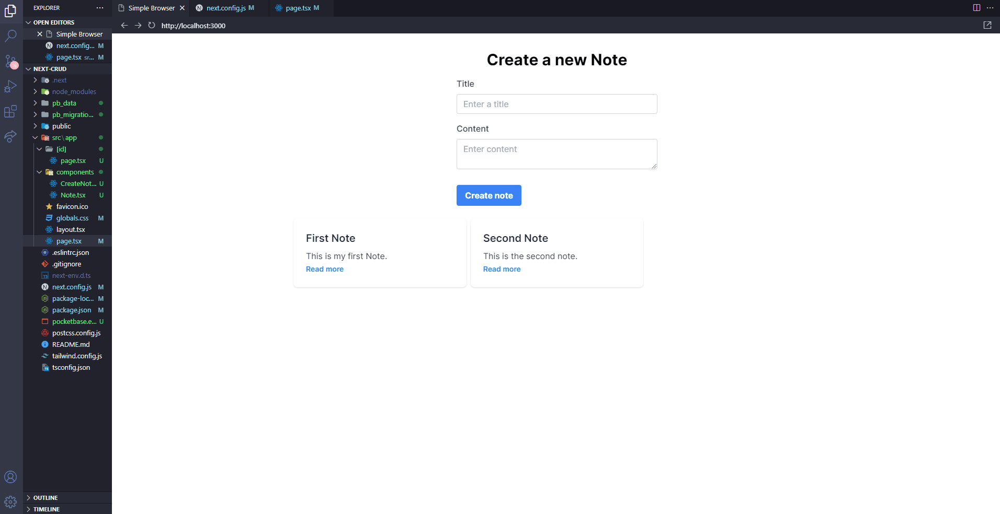

# TODO with next13

<div align="center">
 
</div>

## Technologies Used

The application was developed using the following technologies:

- [Next.js](https://nextjs.org/)
- [React.js](https://reactjs.org/)
- [tailWind](https://postcss.org/)
- [TypeScript](https://www.typescriptlang.org/)

## Installation

To install the application on your machine, follow these steps:

1. Clone the repository to your local machine using the following command:

```sh
git clone [url of the repo]
```

2. Install the dependencies using the package manager npm:

```sh
npm install

```

3. Run the application using the following command:

```sh
npm run dev

```

4. Run the backend with pocketBase (it might require a sign up):

```sh
.\pocketbase.exe serve

```

The application will start in development mode in your default browser at http://localhost:5173.
